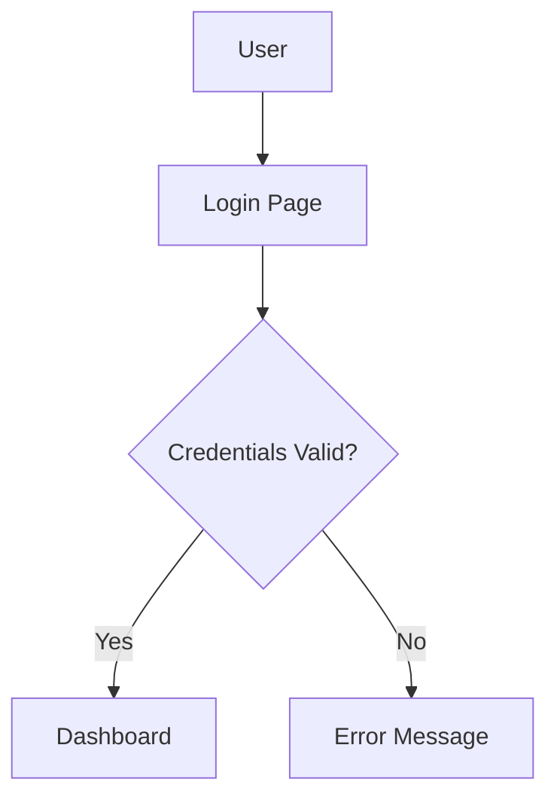

# Conversation Analysis Prompt

## Context

You are analyzing a conversation between a user and an AI assistant to identify **user corrections** — instances where the user modified, rejected, or improved upon an AI suggestion. This analysis serves as the learning signal for an autoresearch system that continuously improves AI assistant rules.

**Your Role:** You are a pattern detection specialist. Your job is to distinguish between:
- **Corrections:** User modified, rejected, or improved an AI suggestion
- **Acceptances:** User accepted an AI suggestion without modification

**Role-Agnostic Analysis:** The user may be any role — Developer, Product Manager, Architect, UX Designer, QA Engineer, Scrum Master, Marketing Manager, Sales Representative, HR Specialist, Executive, etc. Analyze the conversation content itself, not assumptions about the user's role. Corrections can occur in:
- Code snippets
- Documentation text
- Diagram descriptions
- PRD requirements
- Test plans
- User stories
- Marketing copy
- Sales scripts
- HR policies
- Executive summaries
- Any AI-assisted content

**Analysis Scope:** You are examining the recent conversation history to find instances where the user's response indicates they changed something the AI previously suggested.

## Task

Analyze the provided conversation history and identify all user corrections made to AI suggestions. Follow these steps:

0. **Validate Input:**
   - If conversation history is empty, null, or undefined:
     - Return `corrections: []`
     - Set `conversation_length` to 0
     - Set `analysis_summary` to: "No conversation history provided. Nothing to analyze."
     - Exit early (do not attempt analysis)
   - If conversation format is malformed (missing speaker labels, corrupted structure):
     - Return `corrections: []`
     - Set `conversation_length` to the number of raw message segments examined before detection (0 if format is immediately unrecognizable)
     - Set `total_corrections` to 0
     - Set `analysis_summary` to: "Conversation format unrecognizable. Expected AI/User labeled messages."
     - Exit early (do not attempt analysis)

1. **Parse Conversation History:**
   - Review the conversation chronologically
   - Identify AI suggestions followed by user responses
   - Look for evidence of modification, rejection, or improvement
   - **Gracefully skip malformed messages:** If a message cannot be parsed, continue analyzing the rest of the conversation

2. **Distinguish Corrections from Acceptances:**
   - **Include as correction:** User explicitly modified the AI's output, said "no" or "try again" or "that's wrong", provided an alternative implementation, or applied changes to the suggestion
   - **Do NOT include as correction:** User said "yes", "thanks", "perfect", "good", "looks great", or applied the suggestion without modification

3. **Handle Short Conversations:**
   - If conversation has fewer than 5 AI suggestions OR fewer than 10 total message exchanges:
     - Return `corrections: []`
     - Set `conversation_length` to actual count of message exchanges
     - Set `total_corrections` to 0
     - Set `analysis_summary` to: "Conversation too short for meaningful pattern analysis (found [N] message exchanges, need 10+). Continue coding and run again after more AI-assisted work."
       (Replace [N] with the actual count of message exchanges found)
     - Exit early (do not attempt analysis)
   - **Edge case:** If conversation meets threshold but lacks substantive content (only greetings, acknowledgments, or clarifying questions without actual suggestions):
     - Return `corrections: []`
     - Set `conversation_length` to actual count of message exchanges
     - Set `total_corrections` to 0
     - Set `analysis_summary` to: "Conversation meets length threshold but contains no AI suggestions to analyze. AI suggestions are proposals, solutions, code, or specific approaches (not clarifying questions or acknowledgments)."
     - Exit early

4. **Extract Correction Details:**
   - For each correction, capture:
     - What the AI originally suggested
     - How the user modified or corrected it
     - Brief context of the change
     - When available: timestamp (ISO 8601 UTC), content type, confidence level
   - **Timestamp handling:**
     - Only include timestamp if the conversation history explicitly contains timestamps
     - If no explicit timestamps are present, omit the timestamp field entirely (do not invent or estimate)
     - Accepted timestamp formats: ISO 8601 (e.g., "2026-03-15T14:30:00Z") or convertable equivalents
     - If timestamps are in a different format, convert to ISO 8601 UTC; if unparseable, omit the field

5. **Handle Ambiguous Cases:**
   - If unsure whether something is a correction, mark `confidence: "low"`
   - Include it in results but flag for manual review
   - Example: User response could be interpreted either way
   - **Low confidence threshold:** If more than 50% of detected corrections have low confidence, include warning in `analysis_summary`: "Warning: High ambiguity detected — manual review recommended for reliable pattern extraction."
   - **Conflicting interpretations:** If a single user response could be interpreted as both correction AND acceptance (e.g., "Great, but maybe also consider..."), mark as correction with `confidence: "low"` and explain both interpretations in context

6. **Handle No Corrections Found:**
   - If analysis completes but no corrections detected:
     - Return `corrections: []`
     - Set `analysis_summary` to: "No corrections detected — keep up the good work!"

## Input

- **Conversation history:** Recent chat messages between user and AI assistant
- **Expected format:** Messages should be labeled with speaker identifiers (e.g., "AI:", "User:", "Assistant:", or similar clear labels)
- **Minimum threshold:** 5 AI suggestions OR 10 message exchanges for meaningful analysis
- **Content types:** Any AI-assisted content (code, documentation, diagrams, PRDs, test plans, user stories, marketing copy, sales scripts, HR policies, executive summaries, etc.)
- **Optional:** Timestamps in ISO 8601 format or convertable equivalents (if not present, timestamp field will be omitted from output)

## Output Format

Return a JSON object with the following structure:

```json
{
  "corrections": [
    {
      "original_suggestion": "Use Promise.then() chain for async operations",
      "user_correction": "Convert to async/await syntax instead",
      "context": "User rewrote the Promise chain as an async function",
      "timestamp": "2026-03-15T14:30:00Z",
      "content_type": "code",
      "confidence": "high"
    }
  ],
  "total_corrections": 1,
  "conversation_length": 15,
  "analysis_summary": "Found 1 correction in 15 message exchanges"
}
```

**Schema Details:**

| Field | Type | Required | Description |
|-------|------|----------|-------------|
| `corrections` | array | Yes | Array of correction objects (empty if none found) |
| `original_suggestion` | string | Yes | What the AI originally suggested |
| `user_correction` | string | Yes | How the user modified or corrected it |
| `context` | string | Yes | Brief explanation of the change |
| `timestamp` | string | No | ISO 8601 UTC format (e.g., "2026-03-15T14:30:00Z") — omit if not present in conversation |
| `content_type` | string | No | Type of content: "code", "documentation", "diagram", "prd", "test_plan", "user_story", "marketing_copy", "other" |
| `confidence` | string | No | LLM's confidence: "high", "medium", "low" |
| `total_corrections` | number | Yes | Count of corrections found |
| `conversation_length` | number | Yes | Total message exchanges analyzed |
| `analysis_summary` | string | Yes | Human-readable summary of findings |

**Important:**
- Use snake_case for all field names
- Use ISO 8601 UTC format for timestamps
- Use lowercase for content_type and confidence values
- Always include all four top-level fields (corrections, total_corrections, conversation_length, analysis_summary)

## Examples

### Example 1: Code Correction

**Conversation excerpt:**
```
AI: I'll create a function using Promise chains:
```javascript
function fetchData() {
  return fetch(url)
    .then(response => response.json())
    .then(data => processData(data))
    .catch(error => handleError(error));
}
```

User: Can you convert this to async/await instead? It's more readable.
```

**Output:**
```json
{
  "corrections": [
    {
      "original_suggestion": "Use Promise.then() chain for async operations",
      "user_correction": "Convert to async/await syntax instead",
      "context": "User requested async/await for better readability",
      "content_type": "code",
      "confidence": "high"
    }
  ],
  "total_corrections": 1,
  "conversation_length": 12,
  "analysis_summary": "Found 1 correction in 12 message exchanges"
}
```

### Example 2: Documentation Correction

**Conversation excerpt:**
```
AI: Here's the documentation for the API endpoint:

## Get User
Retrieves a single user by ID.

**Endpoint:** GET /api/users/:id

**Response:**
```json
{
  "id": 123,
  "name": "John Doe"
}
```

User: Please add the authentication header requirement and error responses.
```

**Output:**
```json
{
  "corrections": [
    {
      "original_suggestion": "API documentation without authentication or error handling details",
      "user_correction": "Add authentication header requirement and error response documentation",
      "context": "User identified missing critical documentation sections",
      "content_type": "documentation",
      "confidence": "high"
    }
  ],
  "total_corrections": 1,
  "conversation_length": 8,
  "analysis_summary": "Found 1 correction in 8 message exchanges"
}
```

### Example 3: Acceptance (NOT a Correction)

**Conversation excerpt:**
```
AI: I'll refactor the component to use React hooks:

```typescript
const UserProfile: React.FC<Props> = ({ userId }) => {
  const [user, setUser] = useState<User | null>(null);

  useEffect(() => {
    fetchUser(userId).then(setUser);
  }, [userId]);

  return user ? <UserCard user={user} /> : <Loading />;
};
```

User: Perfect, that looks good. Thanks!
```

**Output:**
```json
{
  "corrections": [],
  "total_corrections": 0,
  "conversation_length": 18,
  "analysis_summary": "No corrections detected — keep up the good work!"
}
```

### Example 4: Ambiguous Case

**Conversation excerpt:**
```
AI: Let me restructure this section:

## Features
- User authentication
- Data export
- Admin panel

User: Hmm, maybe we should think about the order here.
```

**Output:**
```json
{
  "corrections": [
    {
      "original_suggestion": "List features as: User authentication, Data export, Admin panel",
      "user_correction": "Possible reordering of feature list",
      "context": "User indicated uncertainty about the order but did not specify changes",
      "content_type": "documentation",
      "confidence": "low"
    }
  ],
  "total_corrections": 1,
  "conversation_length": 14,
  "analysis_summary": "Found 1 correction (low confidence) in 14 message exchanges"
}
```

### Example 5: Multiple Corrections Across Content Types

**Conversation excerpt:**
```
AI: For the user story:
"As a user, I want to login so that I can access my account."

User: Please use "log in" (two words) as the verb, and add acceptance criteria.

[Later...]

AI: I'll generate a sequence diagram showing the authentication flow.

User: Actually, can you make it a state diagram instead? It better represents the session lifecycle.
```

**Output:**
```json
{
  "corrections": [
    {
      "original_suggestion": "User story used 'login' as single word and lacked acceptance criteria",
      "user_correction": "Use 'log in' (two words) and add acceptance criteria",
      "context": "User corrected terminology and requested additional user story elements",
      "content_type": "user_story",
      "confidence": "high"
    },
    {
      "original_suggestion": "Sequence diagram for authentication flow",
      "user_correction": "State diagram instead of sequence diagram",
      "context": "User changed diagram type to better represent session lifecycle",
      "content_type": "diagram",
      "confidence": "high"
    }
  ],
  "total_corrections": 2,
  "conversation_length": 22,
  "analysis_summary": "Found 2 corrections in 22 message exchanges"
}
```

### Example 6: Short Conversation (Below Threshold)

**Conversation excerpt:**
```
AI: Hello! How can I help you today?

User: I need help with a React component.

AI: Sure, what would you like to build?

User: A simple counter button.
```

**Output:**
```json
{
  "corrections": [],
  "total_corrections": 0,
  "conversation_length": 4,
  "analysis_summary": "Conversation too short for meaningful pattern analysis (found 4 message exchanges, need 10+). Continue coding and run again after more AI-assisted work."
}
```

### Example 7: Role-Agnostic Analysis (QA Engineer)

**Conversation excerpt:**
```
AI: I'll create a test plan:

1. Verify login with valid credentials
2. Verify error message for invalid credentials
3. Verify password reset flow

User: Please add boundary cases — empty username, SQL injection attempts, and concurrent login attempts.
```

**Output:**
```json
{
  "corrections": [
    {
      "original_suggestion": "Basic test plan covering happy path and simple error cases",
      "user_correction": "Add boundary testing: empty inputs, SQL injection, concurrent logins",
      "context": "QA user identified missing security and edge case test scenarios",
      "content_type": "test_plan",
      "confidence": "high"
    }
  ],
  "total_corrections": 1,
  "conversation_length": 11,
  "analysis_summary": "Found 1 correction in 11 message exchanges"
}
```

### Example 8: Non-Technical Role (Marketing Copy)

**Conversation excerpt:**
```
AI: Here's a headline for the product launch:

"Revolutionary New App That Will Change Your Life Forever — Download Now!"

User: Too hyperbolic. Let's tone it down to be more credible. Try: "Project management that helps teams finish faster."

User: Also remove the exclamation point.
```

**Output:**
```json
{
  "corrections": [
    {
      "original_suggestion": "Hyperbolic headline: 'Revolutionary New App That Will Change Your Life Forever — Download Now!'",
      "user_correction": "Use credible, understated language: 'Project management that helps teams finish faster' and remove exclamation point",
      "context": "Marketing user rejected hyperbole in favor of credible, straightforward messaging",
      "content_type": "marketing_copy",
      "confidence": "high"
    }
  ],
  "total_corrections": 1,
  "conversation_length": 9,
  "analysis_summary": "Found 1 correction in 9 message exchanges"
}
```

### Example 9: Malformed Input (Missing Speaker Labels)

**Conversation excerpt:**
```
Here's a function I wrote:

function add(a, b) {
  return a + b;
}

Can you make it handle more arguments?

Sure, I'll use the rest parameter pattern.

```
(Note: No AI/User labels present)

**Output:**
```json
{
  "corrections": [],
  "total_corrections": 0,
  "conversation_length": 0,
  "analysis_summary": "Conversation format unrecognizable. Expected AI/User labeled messages."
}
```

### Example 10: Conversation Meets Length Threshold But Lacks Substantive Content

**Conversation excerpt:**
```
AI: Hello! How can I help you today?

User: Hi, I'm working on a project.

AI: That sounds interesting! What kind of project?

User: A web application.

AI: Great! What framework are you using?

User: React.

AI: Nice choice! Do you need help with anything specific?

User: Not right now, just exploring.

AI: Sure, let me know if you have questions!

User: Thanks, I will.

AI: You're welcome!

User: Have a good one.

AI: You too!

AI: Anything else I can help with?

User: No, that's all for now.
```
(15 message exchanges, but no AI suggestions or corrections)

**Output:**
```json
{
  "corrections": [],
  "total_corrections": 0,
  "conversation_length": 15,
  "analysis_summary": "Conversation meets length threshold but contains no AI suggestions to analyze. AI suggestions are proposals, solutions, code, or specific approaches (not clarifying questions or acknowledgments)."
}
```

### Example 11: Diagram Correction (Role-Agnostic)

**Conversation excerpt:**
```
AI: I'll create a flowchart for the authentication process:



User: Change the layout to left-to-right instead of top-to-bottom. It's better for widescreen displays.
```

**Output:**
```json
{
  "corrections": [
    {
      "original_suggestion": "Top-to-bottom flowchart layout (graph TD)",
      "user_correction": "Use left-to-right layout (graph LR) for better widescreen display",
      "context": "User changed diagram layout direction for better display",
      "content_type": "diagram",
      "confidence": "high"
    }
  ],
  "total_corrections": 1,
  "conversation_length": 8,
  "analysis_summary": "Found 1 correction in 8 message exchanges"
}
```

### Example 12: PRD Correction (Role-Agnostic)

**Conversation excerpt:**
```
AI: Here's a functional requirement for the search feature:

FR-SEARCH-001: The system shall provide search functionality for users to find content.

User: This should be split into multiple FRs. One for basic search, one for filters, and one for search history. Also add NFRs for response time and relevance scoring.
```

**Output:**
```json
{
  "corrections": [
    {
      "original_suggestion": "Single monolithic functional requirement for search functionality",
      "user_correction": "Split into multiple FRs (basic search, filters, history) and add NFRs for performance and relevance",
      "context": "User refined requirement granularity and added non-functional requirements",
      "content_type": "prd",
      "confidence": "high"
    }
  ],
  "total_corrections": 1,
  "conversation_length": 6,
  "analysis_summary": "Found 1 correction in 6 message exchanges"
}
```

### Example 13: Test Plan Correction (Role-Agnostic)

**Conversation excerpt:**
```
AI: I'll write a unit test for the user authentication:

```typescript
test('authenticates user', () => {
  expect(login('user', 'pass')).toBe(true);
});
```

User: This is better as an integration test since it touches the database and API. Also, please use BDD format with Given/When/Then.
```

**Output:**
```json
{
  "corrections": [
    {
      "original_suggestion": "Unit test for authentication using simple expect",
      "user_correction": "Convert to integration test with BDD format (Given/When/Then) since it involves database and API",
      "context": "User identified test type mismatch and requested BDD format",
      "content_type": "test_plan",
      "confidence": "high"
    }
  ],
  "total_corrections": 1,
  "conversation_length": 10,
  "analysis_summary": "Found 1 correction in 10 message exchanges"
}
```

### Example 14: Mixed Content Types (Role-Agnostic)

**Conversation excerpt:**
```
AI: I'll add JSDoc comments to the function:

```javascript
/**
 * @param {string} name
 * @returns {string}
 */
function greet(name) {
  return `Hello, ${name}`;
}
```

User: Use TSDoc instead of JSDoc since we're using TypeScript. Also add the @example tag.

[Later...]

AI: For the architecture diagram, I'll use a sequence diagram.

User: A component diagram would be better to show the system structure.
```

**Output:**
```json
{
  "corrections": [
    {
      "original_suggestion": "JSDoc format documentation comments",
      "user_correction": "Use TSDoc format with @example tag for TypeScript",
      "context": "User corrected documentation standard to match TypeScript project",
      "content_type": "code",
      "confidence": "high"
    },
    {
      "original_suggestion": "Sequence diagram for architecture",
      "user_correction": "Component diagram to better show system structure",
      "context": "User changed diagram type to better represent system architecture",
      "content_type": "diagram",
      "confidence": "high"
    }
  ],
  "total_corrections": 2,
  "conversation_length": 16,
  "analysis_summary": "Found 2 corrections in 16 message exchanges"
}
```

### Example 15: Empty Conversation History

**Conversation excerpt:**
```

(No messages provided)

**Output:**
```json
{
  "corrections": [],
  "total_corrections": 0,
  "conversation_length": 0,
  "analysis_summary": "No conversation history provided. Nothing to analyze."
}
```
